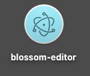
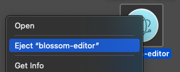

# Table of Contents

1. [Blossom Editor](#blossom-editor)
2. [Warnings](#warnings)
3. [Installation](#installation)
4. [Contributions](#contributions)
5. [License & Attributions](#license--attributions)

# Blossom Editor

   

Blossom Editor is a 2000s era inspired text-editor with a slight modern touch. 

This text-editor is seen as a substitute for your built-in notepad app, doing quick code edits, or basic markdown writing. In short, think of this as a complement to your daily text-editor or IDE when you want to do miniscule things. 

**Created with:**

- Languages: TypeScript, JavaScript

- Framework: Electron

- Editor: CodeMirror 

- Terminal/Pseudoterminal: xterm.js, node-pty

- Markdown Parser: Marked

- Other: exec-sh

- Icon: Twemoji 14.0 - Cherry Blossom

The themes that come with Blossom Editor are slightly and/or heavily modified versions of CodeMirror's default themes that I found to fit best: duotone-dark, zenburn, 3024-night, paraiso-dark, gruvbox-dark, abcdef, and xq-dark, respectively.

Duotone-dark was the theme I initially chose to be the default for Blossom-Editor, and thus modified it accordingly. I like blinking block cursors and the purple-greyish colours, so Duotone-dark was the perfect match as a base.

Sample screenshots.


# Warnings

**1)** You'll be packaging the application, creating the `.dmg`, and installing it yourself. This application is not code signed, so beware of any vulnerabilities or issues that may arise upon installation.

**2)** Due to the lack of a proper load, save, file explorer, and other features, this SHOULD NOT be used in a professional or in a serious workflow of any sort. 

**3)** You are liable for any file loss or damage. Keep in mind that this is a proof-of-concept and experimental project, so nothing about this is perfect in any way shape or form compared to current day text-editors. Also, everyone has different use cases. While this may work well for others, it may not work for you.

**3)** There might be slight performance issues since I haven't done any proper optimizations. Expect variable RAM usage and fans to kick in depending on your system specs.

# Pre-Requisites

To be able to use tabs in Blossom Editor, you must set prefer tabs to always. This is located in your System Preferences:

System Preferences >> General >> Prefer tabs >> "always" when opening documents


Without enabling this, your new tabs will become separate windows.

# Installation

Clone the repository

```bash
git clone <SSH/HTTPS>
```

Change directory

```bash
cd Blossom-Editor
```

Install npm dependencies

```bash
npm install
```

Build package and create the `.dmg`

```bash
make package
#or
npm run package
```

Open `blossom-editor.dmg` located in the root directory and drag the `blossom-editor.app` into the Applications folder as shown:


Don't forget to eject the `.dmg`. This will most likely be located in your Desktop.





# Contributions

Contributions are welcomed.

# License & Attributions

[MIT License](LICENSE).

The [Apache 2.0 License](LICENSE-APACHE-2.0) is included merely for compatibility with the electron-installer-dmg package, but this project will be based on the MIT License.

Please read [NOTICE.md](NOTICE.md) regarding license attributions and other attributions for this project in more detail.