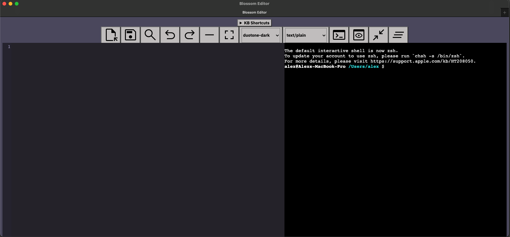
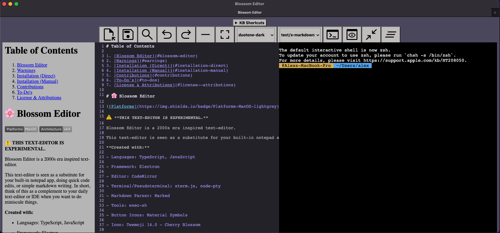
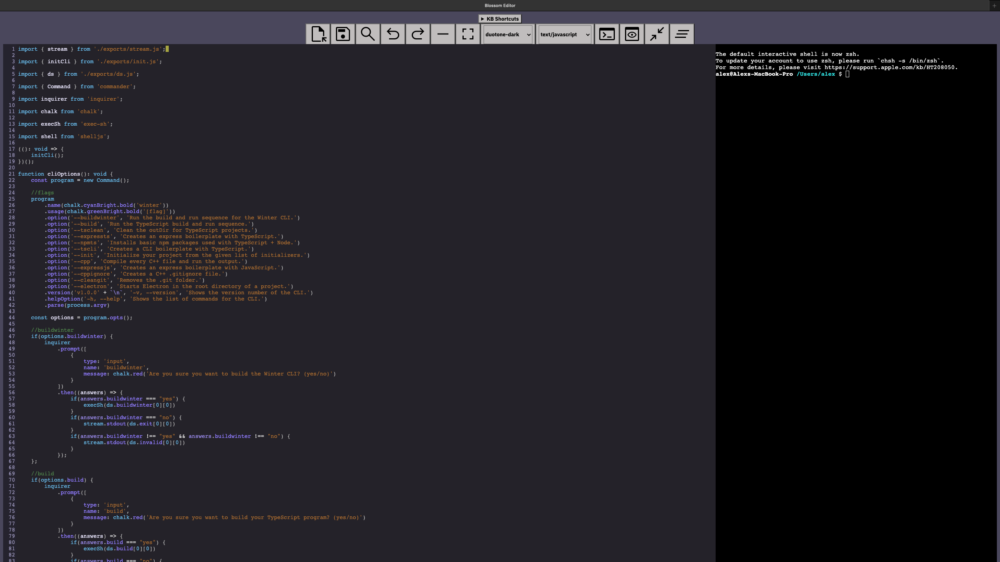
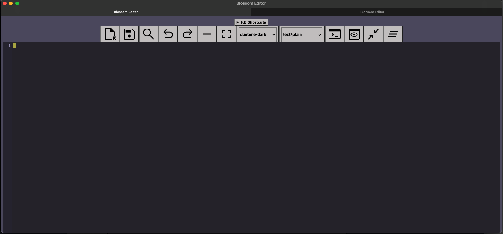
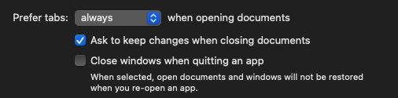
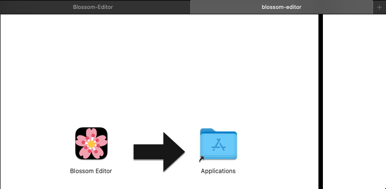

# Table of Contents

1. [Blossom Editor](#blossom-editor)
2. [Warnings](#warnings)
3. [Installation (Direct)](#installation-direct)
4. [Installation (Manual)](#installation-manual)
5. [ARM](#arm)
6. [License & Attributions](#license--attributions)

# 🌸 Blossom Editor

 

⚠️ **THIS TEXT-EDITOR IS EXPERIMENTAL AND A PROOF OF CONCEPT.**

Blossom Editor is a 2000s era inspired text-editor.

**Created with:**

- Languages: TypeScript, JavaScript

- Desktop Framework: Electron

- Editor: CodeMirror 

- Terminal/Pseudoterminal: xterm.js, node-pty

- Markdown Parser: Marked

- Shell Tools: exec-sh

- Button Icons: Material Symbols 

- Icon: Twemoji 14.0 - Cherry Blossom

Sample screenshots.







# Warnings

This text-editor should not be used in production or for daily use.

# Prerequisites

To be able to use tabs in Blossom Editor, you must set prefer tabs to always. This is located in your System Preferences:

System Preferences >> General >> Prefer tabs >> "always" when opening documents



Without enabling this, your new tabs will become separate windows.

# Installation (Direct)

**1)** Go to `Releases` on the right hand side of the repository and download the latest version of the `.dmg` (x64 or arm64 depending on your machine).

**2)** Open the `.dmg` located in the root directory and drag the `blossom-editor.app` into the Applications folder as shown:



**Note:** Don't forget to eject the `.dmg`.

# Installation (Manual)

Clone the repository

```bash
git clone <SSH/HTTPS>
```

Change directory

```bash
cd Blossom-Editor
```

Install npm dependencies

```bash
npm install
```

Compile native modules

```bash
make rebuild 
#or 
npm run rebuild
```

Package app and create the `.dmg`

```bash
# x64: 
make package
#or
npm run package

# arm64: 
make package-arm
# or
npm run package-arm
```

If there are any issues with packaging due to `NODE_MODULE_VERSION` mismatch, you should run `npm rebuild <package>`

Open the `.dmg` located in the root directory and drag the `blossom-editor.app` into the Applications folder as shown:


**Note:** Don't forget to eject the `.dmg`.

# ARM

The `arm64` version has not been tested. As a fallback, the `x64` version should work under Rosetta 2 translation. 

# License & Attributions

[MIT License](LICENSE).

See [NOTICE.md](NOTICE.md) regarding attributions for this project.