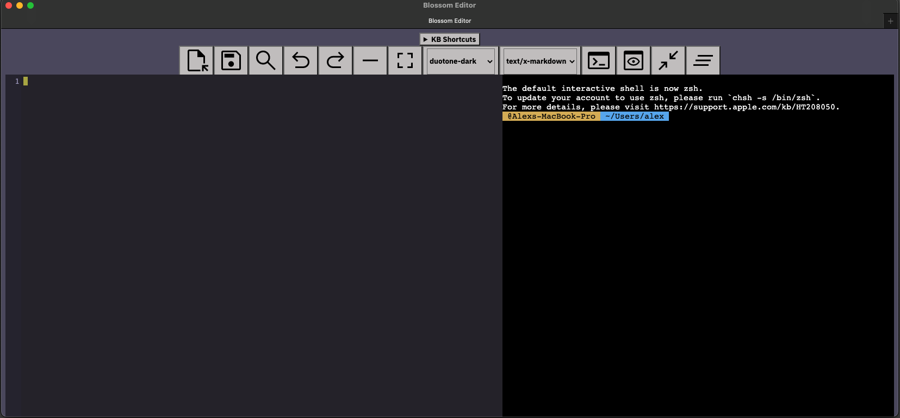
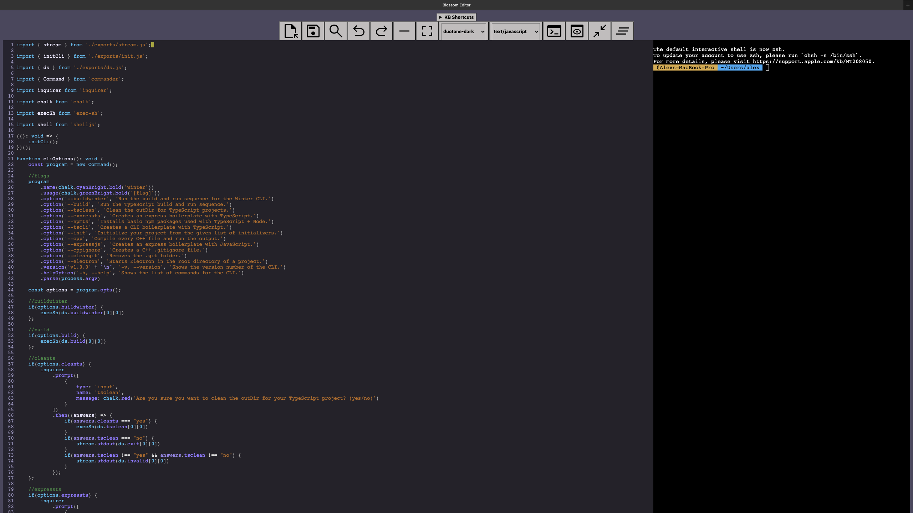
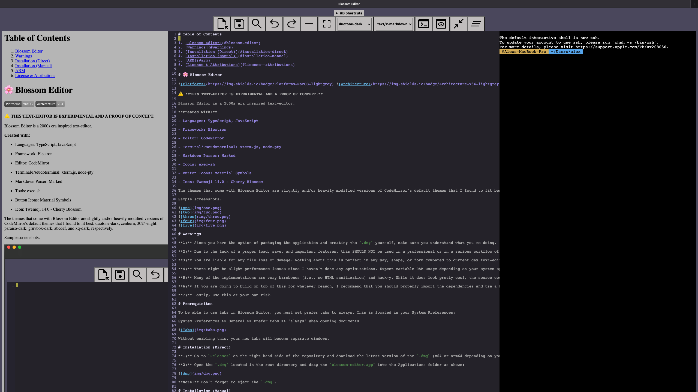
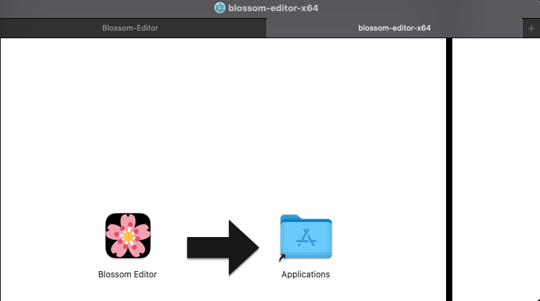

# Table of Contents

1. [Blossom Editor](#blossom-editor)
2. [Warnings](#warnings)
3. [Installation (Direct)](#installation-direct)
4. [Installation (Manual)](#installation-manual)
5. [Contributions](#contributions)
6. [To-Do's](#to-dos)
7. [License & Attributions](#license--attributions)

# 🌸 Blossom Editor

 

⚠️ **THIS TEXT-EDITOR IS EXPERIMENTAL.**

Blossom Editor is a 2000s era inspired text-editor.

This text-editor is seen as a substitute for your built-in notepad app, doing quick code edits, or simple markdown writing. In short, think of this as a complement to your daily text-editor or IDE when you want to do miniscule things. 

**Created with:**

- Languages: TypeScript, JavaScript

- Framework: Electron

- Editor: CodeMirror 

- Terminal/Pseudoterminal: xterm.js, node-pty

- Markdown Parser: Marked

- Tools: exec-sh

- Button Icons: Material Symbols 

- Icon: Twemoji 14.0 - Cherry Blossom

The themes that come with Blossom Editor are slightly and/or heavily modified versions of CodeMirror's default themes that I found to fit best: duotone-dark, zenburn, 3024-night, paraiso-dark, gruvbox-dark, abcdef, and xq-dark, respectively.

Duotone-dark was the theme I initially chose to be the main default for Blossom-Editor, and modified it accordingly. I like blinking block cursors and the purple-greyish colours, so Duotone-dark was the perfect match as a base.

Sample screenshots.







# Warnings

**1)** You have the option of packaging the application and creating the `.dmg` yourself. All the install methods do not have a `.dmg` that is code signed.

**2)** Due to the lack of a proper load, save, file explorer, and other features, this SHOULD NOT be used in a professional or in a serious workflow of any sort. 

**3)** You are liable for any file loss or damage. Nothing about this is perfect in any way, shape, or form compared to current day text-editors. Everyone has different use cases as well. While this may work fine for others, it may not work for you.

**4)** There might be slight performance issues since I haven't done any optimizations. Expect variable RAM usage depending on your system specs.

**5)** Use this at your own risk. 

# Pre-Requisites

To be able to use tabs in Blossom Editor, you must set prefer tabs to always. This is located in your System Preferences:

System Preferences >> General >> Prefer tabs >> "always" when opening documents


Without enabling this, your new tabs will become separate windows.

# Installation (Direct)

**1)** Go to `Releases` on the right hand side of the repository and download the latest version of the `.dmg` (x64 or arm64 depending on your machine).

**2)** Open the `blossom-editor.dmg` located in the root directory and drag the `blossom-editor.app` into the Applications folder as shown:



**Note:** Don't forget to eject the `blossom-editor.dmg`.

# Installation (Manual)

Clone the repository

```bash
git clone <SSH/HTTPS>
```

Change directory

```bash
cd Blossom-Editor
```

Install npm dependencies

```bash
npm install
```

Build package and create the `.dmg`

```bash
# x64: 
make package
#or
npm run package

# arm64: 
make package-arm
# or
npm run package-arm
```

Open the `blossom-editor.dmg` located in the root directory and drag the `blossom-editor.app` into the Applications folder as shown:


**Note:** Don't forget to eject the `blossom-editor.dmg`.

# ARM

The `arm64` version has not been tested since I don't have access to a Apple Silicon machine to install it. As a fallback, the `x64` version should work under Rosetta 2 translation. 

# Contributions

Contributions are welcomed.

# To-Do's

- Implement a proper load and save function to make it more stable for daily usage. At the moment, this is the biggest flaw with the app. 

# License & Attributions

[MIT License](LICENSE).

See [NOTICE.md](NOTICE.md) regarding attributions for this project.